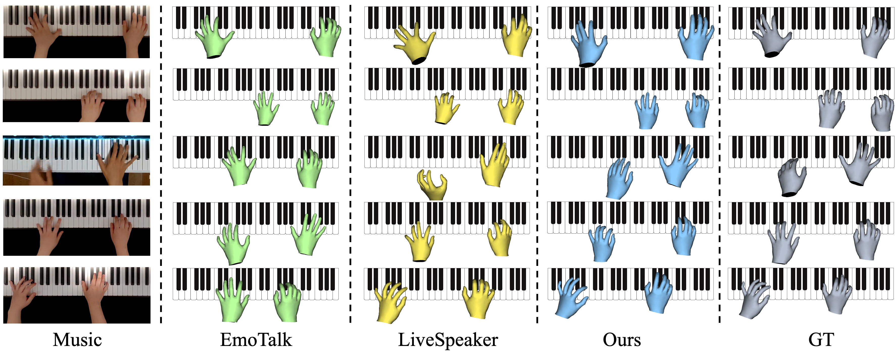

<div align="center">
<h1> PianoMotion10M </h1>
<h3>Dataset and Benchmark for Hand Motion Generation in Piano Performance</h3>

[Qijun Gan](https://github.com/agnJason)<sup>1</sup>, [Song Wang](https://songw-zju.github.io/)<sup>1</sup>, Shengtao Wu<sup>2</sup> ,[Jianke Zhu](https://scholar.google.cz/citations?user=SC-WmzwAAAAJ)<sup>1</sup> <sup>:email:</sup>
 
<sup>1</sup> Zhejiang University, <sup>2</sup> Hangzhou Dianzi University

(<sup>:email:</sup>) corresponding author.

[ArXiv Preprint](https://arxiv.org/abs/2406.09326) &nbsp;&nbsp;&nbsp;&nbsp; [Project Page](https://agnjason.github.io/PianoMotion-page/) &nbsp;&nbsp;&nbsp;&nbsp; Dataset[[Google Drive](https://drive.google.com/drive/folders/1JY0zOE0s7v9ZYLlIP1kCZUdNrih5nYEt?usp=sharing)]/[[Hyper.ai](https://hyper.ai/datasets/32494)]/[[zenodo](https://zenodo.org/records/13297386)]

</div>

#
### News
* **`Jun. 14th, 2024`:** Paper is available at [arxiv](https://arxiv.org/abs/2406.09326). ☕️
* **`Jun. 1st, 2024`:** We released our code and datasets! Paper is coming soon. Please stay tuned! ☕️

## Abstract

Recently, artificial intelligence techniques for education have been received increasing attentions, while it still remains an open problem to design the effective music instrument instructing systems. Although key presses can be directly derived from sheet music, the transitional movements among key presses require more extensive guidance in piano performance. In this work, we construct a piano-hand motion generation benchmark to guide hand movements and fingerings for piano playing. To this end, we collect an annotated dataset, PianoMotion10M, consisting of 116 hours of piano playing videos from a bird's-eye view with 10 million annotated hand poses. We also introduce a powerful baseline model that generates hand motions from piano audios through a position predictor and a position-guided gesture generator. Furthermore, a series of evaluation metrics are designed to assess the performance of the baseline model, including motion similarity, smoothness, positional accuracy of left and right hands, and overall fidelity of movement distribution. Despite that piano key presses with respect to music scores or audios are already accessible, PianoMotion10M aims to provide guidance on piano fingering for instruction purposes.

## Introduction
<div align="center"><h4>PianoMotion10M is a large-scale piano-motion dataset. And we present a benchmark for hand motion generation with piano music.</h4></div>


Overview of our framework. We collect videos of expert piano performances from the internet and annotated and processed them to obtain a large-scale dataset, PianoMotion10M, comprising piano music and hand motions. Building upon this dataset, we establish a benchmark aimed at generating hand movements from piano music.

## Models

Sample results of our generation model.

https://github.com/user-attachments/assets/f346608b-cfe3-4984-a39a-c8ae5794f7bf

https://github.com/user-attachments/assets/1bed9659-a88d-4b84-8a16-f787ad0de822

https://github.com/user-attachments/assets/8860cf2e-1146-45ca-8d96-59ac161fdc03


> Results from the [PianoMotion10M paper]()




|    Method     |  Backbone  |   Decoder   |  FID  | PARAMs |
|:-------------:|:----------:|:-----------:|:-----:|:------:| 
|    EmoTalk    |   HuBert   | Transformer | 4.645 |  308   |
| LivelySpeaker |   HuBert   | Transformer | 4.157  |  321   |
|   Our-Base    | Wav2Vec2.0 |     SSM     | 3.587 |  320   |
|   Our-Base    |   Wav2Vec2.0   | Transformer | 3.608 |  323   |
|   Our-Base    | HuBert |     SSM     | 3.412 |  320   |
|   Our-Base    |   HuBert   | Transformer | 3.529 |  323   |
|   Our-Large   |   Wav2Vec2.0   |     SSM     | 3.453  |  539   |
|   Our-Large   |   Wav2Vec2.0   | Transformer | 3.376 |  557   |
|   Our-Large   |   HuBert   |     SSM     | 3.395  |  539   |
|   Our-Large   |  HuBert   | Transformer | **3.281** |  557   |

**Notes**: 

- All the experiments are performed on 1 NVIDIA GeForce RTX 3090Ti GPU.


## Getting Started
- [Installation](docs/install.md)
- [Prepare Dataset](docs/prepare_dataset.md)
- [Train and Eval](docs/train_eval.md)

## Citation
If you find PianoMotion10M is useful in your research or applications, please consider giving us a star 🌟 and citing it by the following BibTeX entry.
```bibtex
@inproceedings{gan2024pianomotion,
  title={PianoMotion10M: Dataset and Benchmark for Hand Motion Generation in Piano Performance},
  author={Gan, Qijun and Wang, Song and Wu, Shengtao and Zhu, Jianke},
  year={2024},
}
```
